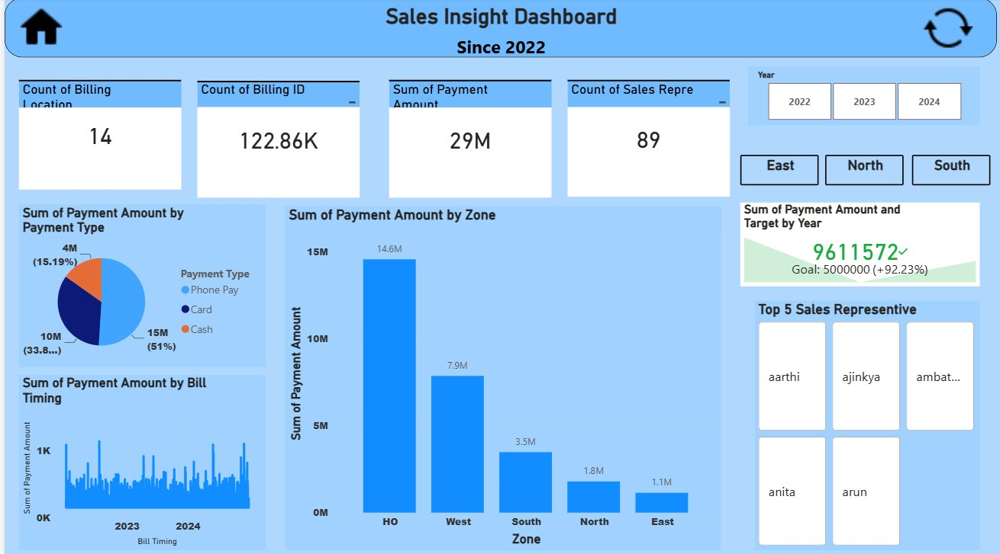

# Sales Insight Dashboard

An interactive Power BI dashboard analyzing sales performance across 4 billing locations and 3 zones, tracking 122.86K billing transactions worth ₹29M+ in total revenue since 2022.



## Business Problem

The dashboard was built to give business users a single view to answer:

- How is revenue trending year-over-year, and are we hitting targets?
- Which zones and billing locations are over- or under-performing?
- How do customers prefer to pay, and does that vary by location?
- Who are the top-performing sales representatives?

## Key Metrics

| Metric | Value |
|---|---|
| Billing Locations | 14 |
| Total Billing Transactions | 122.86K |
| Total Payment Amount | ₹29M |
| Sales Representatives | 89 |
| Revenue vs Target | ₹9,611,572 achieved vs ₹5,000,000 goal — **92.23% above target** |

## Key Findings

**1. HO (Head Office) zone dominates revenue.** It accounts for ₹14.6M of total payment volume — more than the next two zones (West: ₹7.9M, South: ₹3.5M) combined.

**2. Phone Pay is the dominant payment method**, making up 51% of total payment volume, followed by Card (33.8%) and Cash (15.19%) — useful for prioritizing which payment channels to optimize or promote.

**3. Revenue significantly exceeded target.** Against a ₹5M goal, the dashboard tracked ₹9.6M in actual payments — a surplus of over 92%, indicating the original target may need to be revised upward for future periods.

**4. Performance is concentrated.** The gap between the top zone (HO at ₹14.6M) and the lowest zone (East at ₹1.1M) is more than 13x, highlighting an opportunity to investigate what's driving HO's outsized performance and whether it can be replicated.

## Tools Used

- **Power BI** — dashboard design, data visualization, interactive filtering
- **DAX** — custom measures for KPI cards, payment aggregations, and target-vs-actual tracking
- **Data Modeling** — relational structure connecting Sales Data, Location Data, Customer Data, and a calendar table to support accurate cross-filtering

## Dashboard Features

The Main Sheet dashboard includes:

- **4 KPI cards** — Count of Billing Location, Count of Billing ID, Sum of Payment Amount, Count of Sales Representatives
- **Pie chart** — Sum of Payment Amount by Payment Type (Phone Pay, Card, Cash)
- **Bar chart** — Sum of Payment Amount by Zone
- **Line chart** — Sum of Payment Amount by Bill Timing (trend across 2023-2024)
- **KPI/target visual** — Payment Amount vs Target by Year, with variance indicator
- **Top 5 Sales Representative** list, ranked by performance
- **Interactive filters** — Year (2022, 2023, 2024) and Zone (East, North, South) navigation buttons

## Data Model

The underlying model connects the following tables:

- `Sales Data` — transaction-level records (Billing ID, Billing Location, Payment Amount, Payment Type, Sales Representative, Bill Timing)
- `Location Data` — billing location to zone mapping
- `Customer Data` — supporting payment-type measures
- Calendar tables for year-over-year and date-hierarchy filtering

## Repository Structure

```
Sales-Insight-Dashboard/
├── Sales_Insight_Dashboard.pbix
├── dashboard_preview.png
└── README.md
```

## How to Use

1. Clone or download this repository
2. Open `Sales_Insight_Dashboard.pbix` in Power BI Desktop
3. Use the Year and Zone filters on the Main Sheet to explore performance by period and region

## Author

Built as a portfolio project to demonstrate Power BI dashboard design, DAX measure creation, and data modeling skills.
